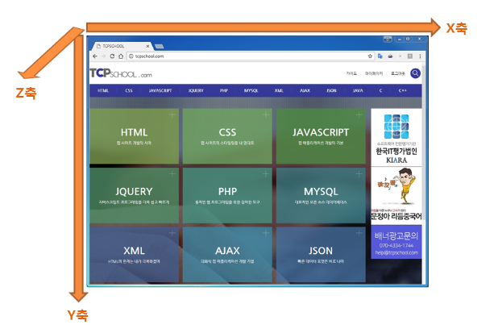

# What I Learned Project6

> `Project6`을 진행하면서 내가 배웠던 것들

## 3D Cude를 만드는 방법

3D 공간 생성

- perspective

  > `원근법`이라는 의미로 사용됨

  > perspective : 1000px

- transform-style: preserve-3d;

큐브 생성

- `transform3d` 를 이용해서 6개의 면 배치

  > 공간감각 필요...🙃

3D 좌표축계



- 양수/음수는 좌표축계에 의해서 결정

  > 이미지에서 나와있는 방향이 양수 / 그 반대방향은 음수

- rotate3d(deg : 양수(시계방향 회전))

## 이미지를 쪼개는 방법

> background-position 이용

background shorthand

```css
img {
  background: #000 url(images/bg.gif) no-repeat top right;
}
```

> background-color background-image background-repeat `background-position` 순서로 들어감

> background-position의 위치를 조절하여 이미지를 쪼갠듯한 효과를 줄 수 있다. 큐브에서는 각각의 보여지는 영역에서 이미지를 y축 방향으로 이동하여 쪼개지게 만든 것!

#### 단축속성에 관해서<주의>

> [참고문서](https://developer.mozilla.org/ko/docs/Web/CSS/Shorthand_properties)

단축 속성에 지정하지 않은 값은 기본값이 된다. <b>이전에 정의한 값도 초깃값으로 재정의</b>된다.

```css
img1 {
  background-color: red;

  background: url(images/bg.gif) no-repeat top right;
}
```

> 해당 코드에서 단축속성에서 background-color를 지정하지 않았기때문에 기본값(transparent)으로 자동지정되어 위의 red를 오버라이딩한다.

## delay rotating

> transition-delay 이용

transition shorthand

```css
.box1 {
  /* property name | duration | delay */
  transition: margin-left 4s 1s;
}

.box2 {
  /* property name | duration | timing function | delay */
  transition: margin-left 4s ease-in-out 1s;
}

.box3 {
  /* Apply to 2 properties */
  transition: margin-left 4s, color 1s;
}
```

## Challenges

[ ] 정사각형 큐브로 구현하여서 양 옆 / 위아래 회전, 즉 모든 방향으로 회전이 가능한 큐브 슬라이더
